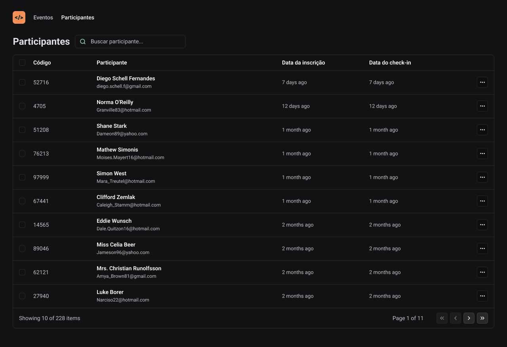

<h1 align="center"> NLW-Unite-React </h1>

  <a href="#-tecnologias">Tecnologias</a>&nbsp;&nbsp;&nbsp;|&nbsp;&nbsp;&nbsp;
  <a href="#-projeto">Desafio</a>&nbsp;&nbsp;&nbsp;|&nbsp;&nbsp;&nbsp;
  <a href="#-layout">Layout</a>

 

## 🚀 Tecnologias

Esse projeto foi desenvolvido com as seguintes tecnologias:

- ReactJs
- Tailwind CSS
- Git e Github
- Figma

## 💻 Sobre o projeto

Pass-In é um aplicativo desenvolvido para agilizar o gerenciamento de participantes em reuniões, a partir de um layout pronto no Figma.

## 🔖 Layout

  

